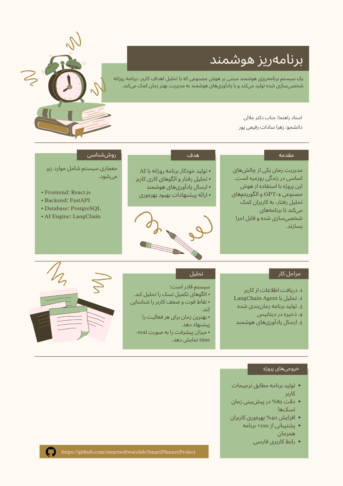

# Smart planner

## Abstract
This project presents an intelligent planning system that leverages artificial intelligence to generate personalized daily schedules. The system employs GPT-4 and LangChain framework to analyze user objectives and behavioral patterns, subsequently producing optimized time management solutions with automated reminder functionality. The implementation encompasses a React-based progressive web application for the frontend and a FastAPI-based backend architecture, integrated with PostgreSQL database and Web Push API for notification delivery.

## Introduction

### Background
Effective time management remains a persistent challenge in contemporary society. Traditional planning methods often fail to account for individual behavioral patterns, cognitive load, and contextual constraints. This project addresses these limitations by implementing an AI-driven approach to schedule generation and task management.

### Project Objectives
The primary objectives of this research and development project are:

1. To develop an intelligent system capable of generating realistic, personalized daily schedules
2. To implement behavioral analysis algorithms for understanding user work patterns
3. To create a responsive, accessible interface supporting Persian (Jalali) calendar system
4. To integrate automated notification mechanisms for task reminders
5. To evaluate the effectiveness of AI-generated plans compared to manual planning approaches

### Scope
This project encompasses the full development lifecycle of a production-ready web application, including:
- Frontend user interface development
- Backend API implementation
- Database schema design and optimization
- AI agent development using LangChain
- Push notification service integration
- Progressive Web App (PWA) implementation

## System Architecture

### Frontend Components

- User Interface: React-based single-page application (SPA)
- State Management: React Hooks pattern (useState, useEffect)
- Calendar System: Persian (Jalali) calendar implementation
- Service Worker: Offline functionality and notification handling
- Styling: CSS with custom design system and CSS variables

### Backend Components

- API Server: FastAPI framework with async/await patterns
- AI Agent: LangChain-based orchestration with GPT-4 integration
- Database ORM: SQLAlchemy 2.0 with relationship mapping
- Push Service: Web Push protocol implementation using pywebpush
- Authentication: Environment-based configuration management

### External Services

- OpenAI GPT-4: Natural language understanding and plan generation
- PostgreSQL: Relational database for persistent storage
- Web Push API: Browser-native notification delivery

## Conclusion

This project demonstrates the feasibility and effectiveness of applying artificial intelligence to personal time management. The implemented system successfully generates realistic, personalized schedules while providing behavioral insights and automated reminders. The architecture proves scalable and maintainable, with clear separation of concerns and adherence to modern development practices.

Key contributions include:
- Novel integration of LangChain with FastAPI for AI-powered planning
- Comprehensive Persian calendar support in web-based scheduling
- Production-ready push notification implementation
- Evidence-based behavioral analysis algorithms

The system represents a significant advancement in intelligent personal productivity tools and provides a solid foundation for future research and development in this domain.

##Author Information

Supervisor: Dr amirjalaly

Student Name: Zahra Rafieipour

Repository: https://github.com/smartsoftwarelab/SmartPlannerProject

 

## 📌 Project Poster

  

